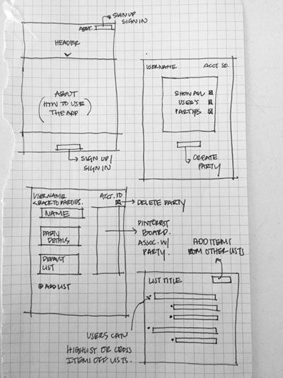
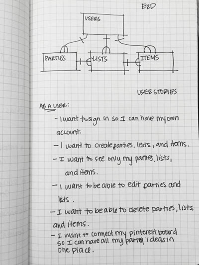

## Pin Planner

[Deployed App](https://jenboyd.github.io/capstone-ember/)

This app was created for General Assembly's WDI Capstone Project. The
repo for the API designed for this project is located [here](https://github.com/jenboyd/capstone-api).

The concept for this project was to create a party planning tool that allows
users set up lists of things they will need, ideas, or whatever it is they want
to use the app's lists tool for. It is very customizable and users can
create the hierarchy they need for their planning process. They are able to sign in and
create parties and create lists for each of those parties.

The following technologies are used to create the client for Pin Planner:
   - Ember
   - HTML / CSS
   - SASS
   - Javascript

## Wireframes & User Stories

  

## Next Steps

I plan to implement a new feature that gives users the ability to add
boards they create on Pinterest to their planner and continue to improve
the custimization options for lists.
